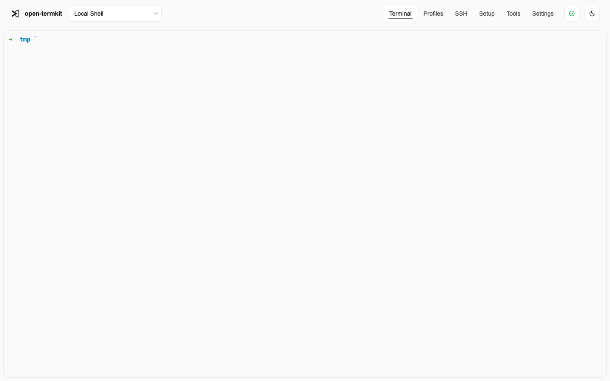
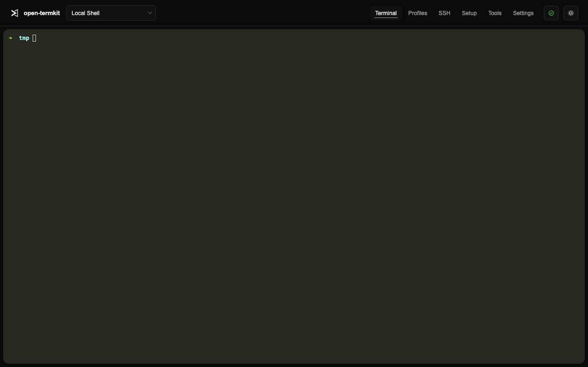

# open-termkit

<p align="center">
  
</p>

`open-termkit` is a local terminal environment built around wterm. It ships as a single Go binary that serves a static web UI, opens local PTY-backed shell sessions, stores profiles in SQLite, and manages setup presets for shells, SSH, tmux, and coding agents.

## Keywords

Local terminal, web terminal, PTY shell, self-hosted developer tools, local-first CLI, SSH profile manager, tmux setup, React terminal UI, Go web app, SQLite profiles, WebSocket terminal, light theme, dark theme.

## Screenshots

### Light theme



### Dark theme



## Current shape

- Go backend and CLI
- SQLite database at `~/.open-termkit/open-termkit.db`
- React + Vite frontend served by Go
- wterm terminal rendering in the browser
- Local PTY sessions over WebSocket
- Terminal profile CRUD
- SSH profile CRUD, key import, and config snippet generation
- Local sync export/import excluding private key contents
- Tool detection/install catalog for tmux, Codex CLI, Claude Code, opencode, and Pi

## Development

```sh
make dev-backend
make dev-frontend
```

The Vite dev server proxies API calls to `http://127.0.0.1:8765`.

## Build

```sh
make build
./bin/open-termkit serve
```

The frontend build output under `web/dist` is embedded into the Go binary at build time.

## Docker

Build the production image:

```sh
make frontend # only needed when web/dist is stale or missing
make docker-build
```

The Dockerfile uses a Debian slim runtime with Bash and OpenSSH client, then embeds the prebuilt static files from `web/dist` into the Go binary. It does not run Node in any Docker build stage, and Node is not part of the runtime image.

Run the app at <http://127.0.0.1:8765> with named volumes for the SQLite database and managed SSH files:

```sh
make docker-run
```

Or run Docker directly:

```sh
docker run --rm -it -p 8765:8765 \
  -v open-termkit-data:/home/open-termkit/.open-termkit \
  -v open-termkit-ssh:/home/open-termkit/.ssh \
  open-termkit:local
```

Smoke test a built image:

```sh
make docker-smoke
```

## Native systemd deployment

For a native Linux install without Docker, use the tracked unit file and deployment helper:

```sh
scripts/deploy-systemd.sh <ssh-host>
```

You can also trigger the manual `Deploy native systemd` GitHub Actions workflow after adding the SSH deployment secret. The service binds to `127.0.0.1:8765` by default and stores state under `/var/lib/open-termkit`. See [`docs/systemd-deployment-plan.md`](docs/systemd-deployment-plan.md) for the full deployment plan, security notes, and reverse proxy guidance.
