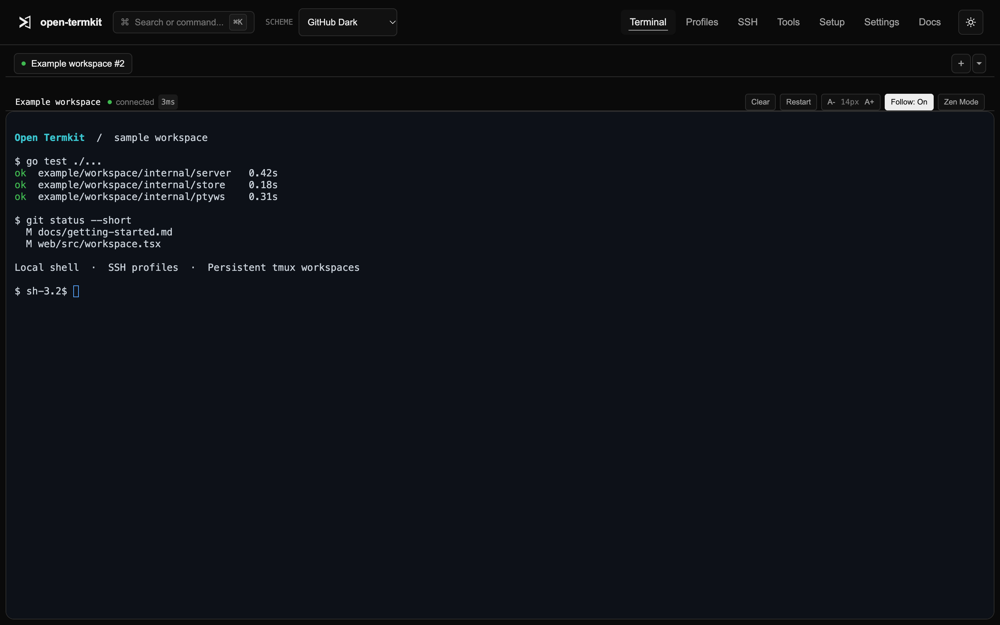
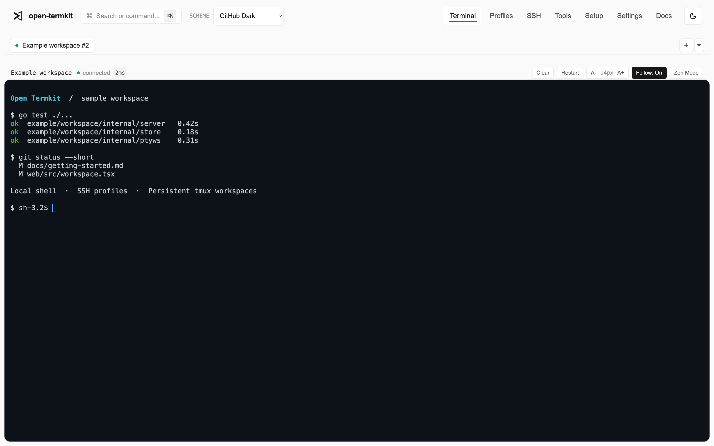

# Open Termkit

<p align="center"></p>

<p align="center">Your shells, SSH hosts, and coding agents. One workspace.</p>

[](https://github.com/natelindev/open-termkit/actions/workflows/ci.yml)
[Documentation](https://open-termkit-cif.pages.dev/) · [Tutorials](docs/README.md) · [Contributing](CONTRIBUTING.md) · [Report a bug](https://github.com/natelindev/open-termkit/issues/new/choose)

Open Termkit is a self-hosted browser workspace for real terminals. A Go server allocates host PTYs, serves an embedded React application, and stores launch profiles in SQLite. Switch between local shells, SSH hosts, and coding-agent profiles without leaving the workspace.



*The running application with an isolated example profile and synthetic terminal output.*

## What you can do

- **Keep several terminals open.** Background tabs retain their connections while you switch views. Use tmux when jobs must survive closing the browser or losing a connection.
- **Manage SSH connections.** Save host profiles, import or generate Ed25519 keys, check TCP reachability, and write managed OpenSSH config snippets.
- **Launch coding agents.** Detect installed Claude Code, Codex, OpenCode, and Pi tools; create launch profiles through setup.
- **Work with your keyboard.** Use Cmd+K / Ctrl+K to switch tabs, open views, and find actions.
- **Choose your appearance.** Light and dark app themes, twelve terminal palettes, font sizing, follow controls, and fullscreen mode.
- **Inspect and move configuration.** Run diagnostics, export/import profiles, and read the bundled bilingual docs at `/docs`.

## Quickstart

Build prerequisites: **Go 1.26+, Node.js 22+, npm, and Git**. A Unix-like host with PTY support is required; macOS and Linux are checked in CI. Node is needed to build assets, not to run the resulting binary.

```sh
git clone https://github.com/natelindev/open-termkit.git
cd open-termkit
make build
./bin/open-termkit serve --port 8765
```

Open <http://127.0.0.1:8765>. The first run initializes profiles and SQLite storage. Run `./bin/open-termkit setup` to refresh detected shells and tools.

```sh
./bin/open-termkit doctor
./bin/open-termkit profile list
```

The server defaults to loopback. **It has no built-in authentication or authorization and currently accepts WebSocket connections from any origin.** For remote access, keep it behind a proxy that authenticates every HTTP and WebSocket route, restricts origins, and provides TLS. Terminal sessions run with the server user's permissions. See the [deployment guide](docs/tutorials/05-production-deployment.md).

## How sessions behave

A tab owns a WebSocket-backed PTY. Switching tabs keeps it alive; closing a tab or disconnecting can terminate the shell. Use a tmux profile such as `tmux new-session -A -s main` for durable work. Open Termkit does not replace an SSH server or a multi-user access-control system.

## State and configuration

| Location | Contents |
| --- | --- |
| `~/.open-termkit/open-termkit.db` | SQLite terminal profiles, SSH hosts, and settings |
| `~/.ssh/open-termkit/` | Managed keys and generated SSH config |
| `~/.ssh/config` | Optional Include reference to managed config |

Use the global `--db /path/to/file.db` option to select another database. Exported sync bundles omit private key contents but can contain hostnames, paths, and environment settings; review them before sharing. Back up private keys separately.

## Commands

| Command | Purpose |
| --- | --- |
| `serve --host 127.0.0.1 --port 8765` | Start UI and API; port 0 selects a free port |
| `setup` / `doctor` | Initialize presets / inspect the host |
| `profile list / get / create / update / delete` | Manage terminal launch profiles |
| `ssh list / create / import-key / write-config` | Manage SSH hosts, keys, and config |
| `tools list / detect / install` | Inspect and install catalog tools |
| `sync export --file bundle.json` | Export configuration without private key contents |
| `sync import --file bundle.json` | Import configuration |

Run any subcommand with `--help` for its flags. [CLI reference](docs/reference/cli.md) · [HTTP/WebSocket reference](docs/reference/api.md).

## Development

```sh
make dev                   # Backend :8765; Vite :5173
make test
go vet ./...
make build
```

The documentation source is `docs-site/`; `make frontend` embeds its build beneath the application's `/docs`. The public [Cloudflare site](https://open-termkit-cif.pages.dev/) serves documentation only. The PTY backend runs on your own host.

## Deployment

For a container, run `make frontend` and `make docker-build`, then bind the published port to loopback:

```sh
docker run -d --name open-termkit --restart unless-stopped \
  -p 127.0.0.1:8765:8765 \
  -v open-termkit-data:/home/open-termkit/.open-termkit \
  -v open-termkit-ssh:/home/open-termkit/.ssh \
  open-termkit:local
```

For Linux systemd deployment, `scripts/deploy-systemd.sh user@your-server` builds and installs a service under a dedicated user. Review the [deployment tutorial](docs/tutorials/05-production-deployment.md) before exposing remote access.

<details><summary>Light theme</summary>



</details>

## License

[MIT](LICENSE). Brand assets and screenshot guidance are in [docs/assets/brand](docs/assets/brand/README.md).
